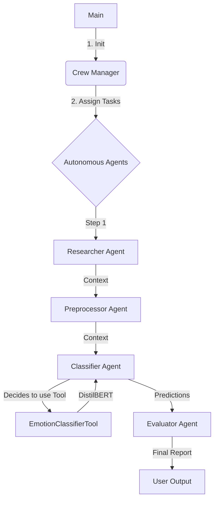

# AgenticAffect-CrewAI: Autonomous Multi-Agent Emotion Analysis

A cutting-edge, agentic AI system leveraging CrewAI and LLMs to create a collaborative swarm of autonomous agents for intelligent emotion analysis.

## 🚀 Skills & Technologies
*   **AI Agents Framework**: CrewAI, LangChain
*   **Large Language Models (LLM)**: Ollama, Llama 3.2 (Local Inference)
*   **Natural Language Processing**: Transformers (Hugging Face), DistilBERT
*   **Development**: Python 3.11, Tool Engineering
*   **Concepts**: Agentic Workflows, Role-Playing, Autonomous Task Execution, Chain-of-Thought
*   **Deployment**: Local LLM Orchestration

## Project Description
**AgenticAffect-CrewAI** represents the next evolution in software architecture: **Agentic Workflows**. Unlike traditional scripts, this system defines a team of AI agents—a Researcher, Preprocessor, Classifier, and Evaluator—each with a distinct persona, goal, and backstory. These agents collaborate autonomously using a local Large Language Model (Llama 3.2) to reason about data, execute complex tools, and synthesize comprehensive reports.

## Problem Statement
Deterministic code handles structured tasks well but fails at reasoning and adaptability. Hard-coded pipelines cannot explain "why" a text is sad, nor can they adapt their preprocessing strategy based on context. Traditional NLP lacks the semantic understanding and collaborative depth of a human team.

## Solution Overview
This repository implements an **Autonomous Agent Swarm**:
1.  **Role-Based Agents**: Each agent is an "expert" LLM instance specialized in a domain (e.g., the `Researcher` is an expert in NLP datasets).
2.  **Tool Use**: The `Classifier` agent is equipped with a custom Python tool (`EmotionClassifierTool`) that allows it to bridge the gap between generative AI reasoning and precise DistilBERT classification.
3.  **Collaborative Flow**: Agents pass information sequentially, with each step enriched by the previous agent's insights.

## System Architecture
*Refer to the architecture diagram for a visual representation of component interactions.*




## Workflow
The system executes an autonomous sequential process managed by the `Crew`:
1.  **Bootstrapping**: Connects to the local Ollama instance running Llama 3.2.
2.  **Task 1 (Analysis)**: The `Researcher` agent inspects the dataset and generates a qualitative summary of its contents.
3.  **Task 2 (Preparation)**: The `Preprocessor` agent plans and executes a data cleaning strategy.
4.  **Task 3 (Classification)**: The `Classifier` agent receives text, recognizes the need for precision, **autonomously calls the `EmotionClassifierTool`**, and interprets the results.
5.  **Task 4 (Evaluation)**: The `Evaluator` agent reviews the predictions against ground truth and writes a final performance assessment.

## Folder Structure
```text
AgenticAffect-CrewAI/
├── src/
│   └── main.py          # Crew Definition & Entry Point
├── .gitignore           # Version Control Configuration
├── architecture_comparison.md # OOP vs Agentic Comparison
├── README.md            # Project Documentation
└── requirements.txt     # Dependencies
```

## Features
*   **Local LLM Inference**: Fully privacy-preserving AI running locally via Ollama.
*   **Custom Tool Engineering**: Seamless integration of deterministic Python functions (Hugging Face) into the LLM's toolset.
*   **Cognitive Architecture**: Agents have memory and context, allowing them to reference previous steps in the pipeline.
*   **Flexible Reasoning**: Unlike the OOP version, agents can provide qualitative explanations for *why* a metric might be low or high.

## Installation & Setup
1.  **Clone the repository**:
    ```bash
    git clone https://github.com/maryamharoon/AgenticAffect.git
    cd AgenticAffect-CrewAI
    ```

2.  **Install Python dependencies**:
    ```bash
    pip install -r requirements.txt
    ```

3.  **Install & Setup Ollama**:
    *   Download [Ollama](https://ollama.com/).
    *   Pull the Llama 3.2 model:
        ```bash
        ollama pull llama3.2
        ```
    *   Ensure Ollama is running (`ollama serve`).

## Usage
Run the agent swarm. Ensure your local Ollama server is active.

```bash
python src/main.py
```

## Results / Outputs
The output is a rich, conversational log of the agents' work:
*   **Agent Thought Process**: Logs of "Thought: I need to use the classifier tool..."
*   **Tool Outputs**: Raw JSON from the classification model.
*   **Final Report**: A synthesized summary describing the dataset, the analysis process, and the final emotional insights.

## Future Improvements
*   **Multi-Modal Agents**: Incorporate vision agents for analyzing images alongside text.
*   **Vector Memory**: Implement RAG (Retrieval-Augmented Generation) so agents can "remember" past analyses.
*   **Hierarchical Crews**: Implement a Manager Agent to dynamically delegate tasks instead of a sequential flow.

## Author
**Maryam Haroon**
*AI Engineer & Researcher*

## License
This project is licensed under the MIT License.
