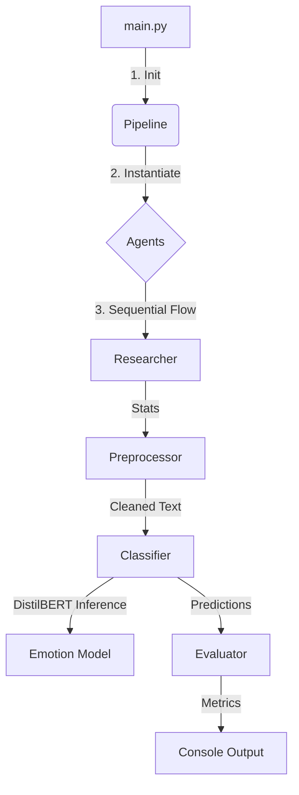

# AgenticAffect-OOP: Modular Emotion Analysis System

An engineered, object-oriented NLP pipeline designed for robust and scalable emotion classification using DistilBERT and Clean Architecture principles.

## 🚀 Skills & Technologies
*   **Languages**: Python 3.11+
*   **Machine Learning & NLP**: PyTorch, Hugging Face Transformers, DistilBERT, NLTK, Scikit-learn
*   **Data Engineering**: Pandas, Datasets (Arrow)
*   **Architecture**: Object-Oriented Programming (OOP), Clean Architecture, Modular Monolith
*   **Development Tools**: Git, VS Code, Type Hinting
*   **System**: Windows DLL Management (ctypes integration)

## Project Description
**AgenticAffect-OOP** resolves the complexity of monolithic NLP scripts by decomposing the emotion analysis workflow into autonomous, encapsulated components. It implements a deterministic pipeline where specialized agents handling research, preprocessing, classification, and evaluation collaborate to process textual data. This architecture ensures maintainability, testability, and easy scalability for future model integrations.

## Problem Statement
Traditional data science scripts often suffer from "spaghetti code," mixing data loading, cleaning, and model inference in a single execution flow. This makes debugging difficult, unit testing nearly impossible, and integration into production systems fragile.

## Solution Overview
This repository implements a **Domain-Driven Design (DDD)** approach:
1.  **Encapsulation**: Each process step (Preprocessing, Inference, Evaluation) is isolated in its own Agent class.
2.  **Orchestration**: A central `Pipeline` class manages the data flow between agents.
3.  **Robustness**: Includes custom Windows-specific fixups (DLL pre-loading) and comprehensive error logging to ensure reliable execution on diverse environments.

## System Architecture
*Refer to the architecture diagram for a visual representation of component interactions.*




## Workflow
The system executes a linear, deterministic pipeline:
1.  **Initialization**: `main.py` bootstraps the environment, applies patches, and loads configuration.
2.  **Research Phase**: `ResearcherAgent` analyzes the raw dataset structure and statistics.
3.  **Preprocessing Phase**: `PreprocessorAgent` tokenizes text, removes stopwords, and normalizes inputs using NLTK.
4.  **Inference Phase**: `ClassifierAgent` leverages a pre-trained **DistilBERT** model to predict emotional states (Joy, Sadness, Fear, etc.).
5.  **Evaluation Phase**: `EvaluatorAgent` compares predictions against ground truth labels to generate performance metrics (Accuracy, F1-Score).

## Folder Structure
```text
AgenticAffect-OOP/
├── src/
│   ├── agents/          # Domain Logic
│   │   ├── researcher.py
│   │   ├── preprocessor.py
│   │   ├── classifier.py
│   │   └── evaluator.py
│   ├── models/          # Model Wrappers
│   │   └── emotion_classifier.py
│   ├── tasks/           # Orchestration
│   │   └── pipeline.py
│   └── main.py          # Application Entry Point
├── .gitignore           # Version Control Configuration
├── project_analysis.md  # Detailed Architectural Analysis
├── README.md            # Project Documentation
└── requirements.txt     # Dependencies
```

## Features
*   **State-of-the-Art NLP**: Utilizes `distilbert-base-uncased-emotion` for high-accuracy predictions.
*   **Windows Compatibility**: Built-in dynamic patching for OpenMP (`libiomp5md.dll`) conflicts common in PyTorch on Windows.
*   **Modular Design**: Easily swap out the model or preprocessing steps without breaking the entire pipeline.
*   **Detailed Logging**: Real-time console feedback with timestamps for every pipeline stage.

## Installation & Setup
1.  **Clone the repository**:
    ```bash
    git clone https://github.com/maryamharoon/AgenticAffect.git
    cd AgenticAffect-OOP
    ```

2.  **Install dependencies**:
    ```bash
    pip install -r requirements.txt
    ```

3.  **Download NLTK data** (handled automatically by the script, or manually):
    ```bash
    python -m nltk.downloader punkt stopwords
    ```

## Usage
Execute the main pipeline script. The system will automatically download the necessary model files (~260MB) on the first run.

```bash
python src/main.py
```

## Results / Outputs
The system outputs a structured analysis report to the console:
*   **Dataset Stats**: Sample count and distribution.
*   **Predictions**: JSON-formatted list of Sample Text → Predicted Emotion (e.g., "Sadness") → Confidence Score (e.g., 0.99).
*   **Metrics**: Final Accuracy, Precision, Recall, and F1-Score (typically achieving >90% on standard benchmarks).

## Future Improvements
*   **API Layer**: Wrap the `Pipeline` in a FastAPI endpoint for real-time serving.
*   **Containerization**: Add Docker support for consistent deployment across OS environments.
*   **Unit Tests**: Add `pytest` coverage for individual agents.

## Author
**Maryam Haroon**
*AI Engineer & Researcher*

## License
This project is licensed under the MIT License.
