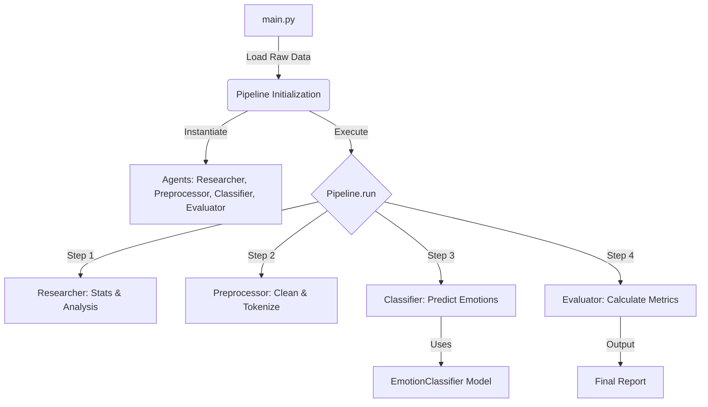

# AgenticAffect-OOP: Code Analysis & Flow

This document provides a comprehensive analysis of the **AgenticAffect-OOP** codebase, explaining the logic, object-oriented structure, and step-by-step execution flow.

## 1. High-Level Architecture
The project follows a **Modular Multi-Agent Architecture**. Each specific task (research, preprocessing, classification, evaluation) is encapsulated within its own "Agent" class. A central `Pipeline` class orchestrates these agents to process data sequentially.

**Key OOP Principles Used:**
*   **Encapsulation**: Each agent manages its own logic (e.g., `PreprocessorAgent` owns stopping words logic).
*   **Single Responsibility Principle (SRP)**: `Researcher` only analyzes data; `Classifier` only predicts; `Evaluator` only scores.
*   **Composition**: The `Pipeline` class is composed of instances of these agents.

## 2. Execution Flow Diagram

## 3. Step-by-Step Logic Analysis

### Step 0: Entry Point (`src/main.py`)
This is the starting point of the application.
1.  **System Setup**: It first applies a workaround (pre-loading `libiomp5md.dll`) to ensure PyTorch works on Windows.
2.  **Data Loading**: It uses the `datasets` library to load the "emotion" dataset from Hugging Face.
3.  **Sampling**: It selects a random sample of 10 rows to verify functionality without processing the entire dataset.
4.  **Pipeline Creation**: It instantiates the `Pipeline` class, passing the raw `texts` and `labels`.
5.  **Execution**: It calls `pipeline.run()` to start the process.

### Step 1: Orchestration (`src/tasks/pipeline.py`)
The `Pipeline` class is the manager.
*   **Initialization (`__init__`)**: When created, it spins up instances of all the specialized agents (`ResearcherAgent`, `PreprocessorAgent`, `ClassifierAgent`, `EvaluatorAgent`) and stores the data.
*   **Execution (`run`)**: It calls these agents in a specific order, passing the output of one as input to the next.

### Step 2: Research (`src/agents/researcher.py`)
*   **Role**: To understand the data before processing.
*   **Logic**: The `ResearcherAgent` contains methods like `summarize_statistics` and `analyze_characteristics` to calculate label distributions and text lengths.
*   **Current Usage**: In the current `demo` flow, the Pipeline manually prints simple stats (count/samples) instead of fully utilizing the Agent's sophisticated analysis methods, but the capability exists for deeper analysis.

### Step 3: Preprocessing (`src/agents/preprocessor.py`)
*   **Role**: To clean raw text so the AI model can understand it better.
*   **Logic**:
    1.  **`clean_text`**: Lowercases text and removes punctuation.
    2.  **`tokenize`**: Splits text into individual words (tokens) using NLTK.
    3.  **`remove_stopwords`**: Filters out common words (like "the", "is", "at") that don't carry emotional weight.
    4.  **`preprocess_batch`**: Applies this pipeline to the entire list of texts.

### Step 4: Classification (`src/agents/classifier.py` & `models/emotion_classifier.py`)
*   **Role**: To predict the emotion of the text.
*   **Model Wrapper (`EmotionClassifier`)**: This class wraps the Hugging Face `transformers` pipeline. It downloads and loads the **DistilBERT** model (`distilbert-base-uncased-emotion`).
*   **Agent Logic (`ClassifierAgent`)**: It uses the model wrapper to get raw predictions (labels and scores) and formats them into a clean dictionary structure (text, emotion, confidence) for the rest of the system to use.

### Step 5: Evaluation (`src/agents/evaluator.py`)
*   **Role**: To judge how well the model performed.
*   **Logic**:
    1.  **Mapping**: It maps string emotions ('joy', 'sadness') to numerical IDs (0, 1) to match the ground truth labels.
    2.  **Metric Calculation**: It calculates:
        *   **Accuracy**: Overall % correct.
        *   **Precision/Recall/F1**: Detailed breakdown of performance per class.
    3.  **Recommendations**: It has logic to suggest improvements (e.g., "Consider improving preprocessing") if scores are too low.

## Summary of Data Flow
1.  **Raw Text** (`main.py`) -> **Pipeline**
2.  Pipeline -> **Preprocessor** -> **Clean Tokens**
3.  Pipeline -> **Classifier** (uses Raw Text) -> **Predictions** (e.g., "Joy", 99%)
4.  Predictions + Ground Truth -> **Evaluator** -> **Metrics** (Accuracy: 100%)
