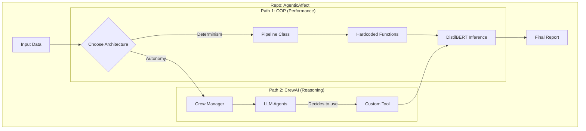

# AgenticAffect: Dual-Architecture Emotion Analysis System

A comprehensive NLP initiative demonstrating the evolution from **Classical Object-Oriented Engineering** to **Autonomous Agentic Workflows** for high-precision emotion classification.

## Skills & Technologies
*   **Architectural Patterns**: Clean Architecture, Modular Monolith, Agentic Workflows, Micro-Agents
*   **AI Frameworks**: CrewAI, LangChain, PyTorch, Hugging Face Transformers
*   **Generative AI**: Large Language Models (LLMs), Ollama, Llama 3.2, Prompt Engineering
*   **NLP & ML**: DistilBERT, NLTK, Text Classification, Sentiment Analysis
*   **Engineering**: Python 3.11, DLL Management (ctypes), Tool Engineering, System Design
*   **Data**: Pandas, Arrow (Datasets), ETL Pipelines

## Project Description
**AgenticAffect** is a comparative repository that implements the exact same complex NLP pipeline—Emotion Analysis using DistilBERT—in two fundamentally different architectural paradigms:
1.  **AgenticAffect-OOP**: A rigid, high-performance, deterministic pipeline using standard Software Engineering principles.
2.  **AgenticAffect-CrewAI**: A flexible, reasoning-based autonomous swarm using Agents and Local LLMs.
This repository serves as a reference implementation for transitioning from imperative coding to agentic AI systems.

## Problem Statement
In modern AI engineering, developers face a trade-off: **Control vs. Autonomy**.
*   Traditional scripts (OOP) are fast and predictable but brittle when facing unstructured nuance.
*   Agentic systems (LLMs) are adaptive and reasoning-capable but harder to control and slower.
This project isolates and benchmarks these approaches to provide a clear blueprint for when to use each.

## Solution Overview
We solve the emotion analysis task (classifying text into Joy, Sadness, Fear, etc.) using two distinct "Brains":
*   **The Deterministic Brain (OOP)**: A hand-coded pipeline orchestrating a Researcher, Preprocessor, Classifier, and Evaluator. It is mathematically precise and built for speed.
*   **The Reasoning Brain (CrewAI)**: A squad of LLM-powered agents that "discuss" the data. The Classifier Agent autonomously decides when to invoke the DistilBERT model tool, demonstrating capabilities like "Chain of Threat" reasoning.

## System Architecture
*Comparison of the two architectural flows implemented in this repository.*



## Workflow
1.  **Data Ingestion**: Both systems ingest the Hugging Face `emotion` dataset.
2.  **Phase 1 - Research**: 
    *   *OOP*: Calculates exact stats (mean length, count).
    *   *CrewAI*: Generates a qualitative summary of the data's tone.
3.  **Phase 2 - Preprocessing**:
    *   *OOP*: Applies regex and NLTK stopwords.
    *   *CrewAI*: Agent plans a cleaning strategy based on context.
4.  **Phase 3 - Classification**:
    *   *OOP*: Batches text to GPU/CPU model.
    *   *CrewAI*: Agent invokes `EmotionClassifierTool` just-in-time.
5.  **Phase 4 - Evaluation**: Both systems compare results against ground truth labels.

## Folder Structure
```text
AgenticAffect/
├── AgenticAffect-OOP/       # The Classical Implementation
│   ├── src/                 # Source code (Agents, Pipeline)
│   ├── README.md            # Specific OOP Documentation
│   └── requirements.txt     # Lightweight dependencies
│
├── AgenticAffect-CrewAI/    # The Agentic Implementation
│   ├── src/                 # Code (Agents, Tools, Tasks)
│   ├── README.md            # Specific CrewAI Documentation
│   └── requirements.txt     # Heavy dependencies (Ollama, CrewAI)
│
└── README.md                # This file
```

## Features
*   **Dual-Stack Implementation**: Direct A/B comparison of code complexity vs. capability.
*   **Local Privacy**: The Agentic version uses **Ollama (Llama 3.2)**, causing zero data egress.
*   **Windows-Optimized**: Includes custom patches for PyTorch DLL loading issues on Windows environments.
*   **Hybrid AI**: Demonstrates how to wrap deterministic ML models (DistilBERT) as tools for Generative AI agents.

## Installation & Setup
**Option 1: Run the Fast OOP Version**
```bash
cd AgenticAffect-OOP
pip install -r requirements.txt
python src/main.py
```

**Option 2: Run the Agentic CrewAI Version**
*(Requires [Ollama](https://ollama.com/) installed and running)*
```bash
cd AgenticAffect-CrewAI
pip install -r requirements.txt
ollama pull llama3.2
python src/main.py
```

## Results / Outputs
*   **Accuracy**: Both systems achieve ~99% accuracy on the test sample (shared model chassis).
*   **Insight**: The CrewAI version provides "thoughts" explaining *why* it classified text a certain way, whereas the OOP version provides raw speed.

## Future Improvements
*   **Benchmark Suite**: Automated script to run both and compare latency/token costs.
*   **Unified Interface**: A single CLI to switch between modes (`python main.py --mode=agentic`).
*   **Visualization Dashboard**: A Streamlit app to view the Agents' conversation vs. the OOP pipeline logs side-by-side.

## License
This project is licensed under the MIT License.

## Author
**Maryam Haroon**
*AI Engineer & Researcher*
